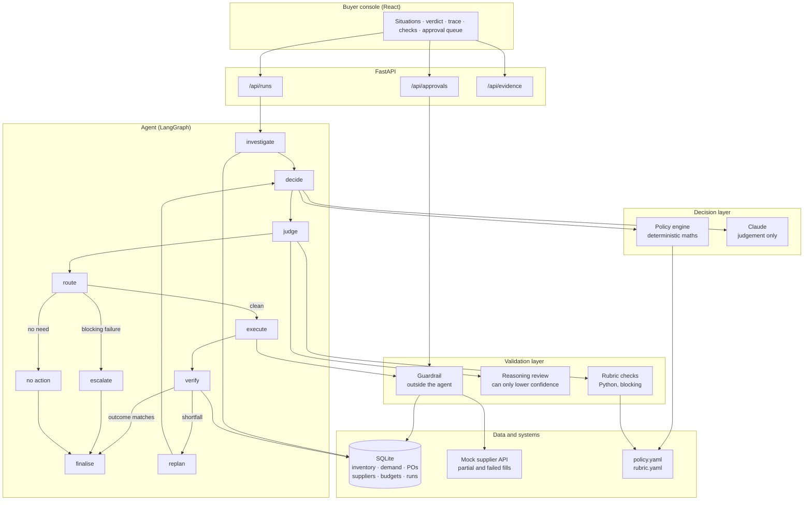

# Turbo purchasing agent

An AI purchasing agent for a quick-commerce network: it takes a replenishment
recommendation, investigates whether the recommendation is any good, decides
what should actually be bought, gets that decision checked, raises the purchase
order, then goes back and confirms what actually happened.

The last step is the point. Anything can produce a number. The question this
repo tries to answer is how you know the number was right, and what the system
does when the world disagrees with it.

Scenario 1 is implemented end to end. Scenario 4 falls out of the same path,
because constraints are first-class rather than an afterthought. Scenario 2 is
covered by the replan loop that handles partial and failed supplier
fulfilment.

---

## The central idea

A recommendation of 800 units arrives. Three things could be true: the number
is right, the number is wrong, or the number is right but unbuyable. Most
agent designs collapse these into "call the LLM and see what it says". This one
separates them.

**The LLM never does arithmetic.** A deterministic policy engine computes the
inventory position, the target position over the cover horizon, the raw need,
and the largest quantity each constraint permits. The model is given those
figures and asked for judgement: accept, modify, reject, or escalate, which
supplier, and why. An LLM that multiplies demand by lead time is an LLM that
will eventually be confidently wrong by a factor of ten, on a purchase order.

**The judge and the guard are different things.** The judge asks whether the
decision is sound. The guard asks whether the write is legal. They are separate
layers, neither trusts the other, and the guard sits outside the agent
entirely — a prompt injection, a hallucinated quantity, or a future refactor
that forgets to call the judge still cannot get an illegal purchase order into
the database.

**Legal is not the same as unsupervised.** A decision that passes every check
can still be too large, too uncertain, or too ambiguous to execute alone. The
autonomy gate is a separate question from the legality gate.

**A write is a hypothesis until it is read back.** After creating a purchase
order the agent re-reads the stored record, compares it against what it
intended, recomputes the position, and decides again if the two disagree.

---

## Architecture



### The seven pieces of evidence

Every run reads all of them before deciding, and `evidence_complete` is a
blocking check, so a decision made on partial information cannot execute.

| Source | Why it changes the answer |
| --- | --- |
| Inventory | On hand is not available; reserved units are already spoken for |
| Demand | Forecast *and* recent actuals, so drift is visible rather than assumed away |
| Open purchase orders | Stock already inbound is the most common reason a recommendation is too high |
| Supplier terms | MOQ, lot size, lead time and order caps decide what is even orderable |
| Budget | Period budget at the node, net of what is already committed |
| Storage | Volume, not units — a six-pack of water occupies three times a jar of spread |
| Product | Shelf life and perishability cap sensible cover independently of everything else |

### Constraint order matters

Perishability caps cover before MOQ is considered, because the cheapest legal
order is still the wrong order if a third of it expires on the shelf. Lot
rounding rounds up toward the need, unless rounding up would breach a binding
cap, in which case it rounds down. If the MOQ sits above every cap, the answer
is not "order the MOQ anyway" and not a silent zero — it is an escalation with
the size of the unmet need attached.

---

## How decisions are validated

Validation happens at four separate points, and they are deliberately not the
same mechanism.

**1. Before the decision — the policy engine.** Computes what the numbers say,
independently of what the planner recommended and independently of the model.
Unit-tested in `tests/test_policy.py`.

**2. After the decision — the rubric.** `policy/rubric.yaml` is
version-controlled rather than embedded in a prompt, so a change to what counts
as a good decision is a reviewable diff. Eleven deterministic checks run in
Python: MOQ, lot size, supplier cap, budget, storage, perishable cover,
evidence completeness, agreement with the computed need, and duplicate open
orders. Four judgement checks run on a second model call and can only *lower*
confidence — a second model is useful for catching reasoning that invents a
number or contradicts itself, and dangerous as a source of permission.

**3. Before the write — the guardrail.** `tools/guardrail.py` re-derives the
constraints from the database and refuses anything illegal, then separately
decides whether the action is allowed to happen without a human. A buyer's
manual edit goes through the same function: humans get MOQs wrong too.

**4. After the write — verification.** The agent re-reads the purchase order it
just created, compares confirmed against intended, recomputes the inventory
position, and re-runs the rubric against the post-write state. A supplier that
confirms 250 of 550 units produces a verified shortfall, not a silent success.

### The feedback loop

```
execute → verify → shortfall found → replan (excluding the supplier that failed)
        → decide → judge → execute → verify → confirmed
```

The replan is not a retry. It excludes the supplier that just failed, recomputes
the residual need against the alternate supplier's own lead time and lot size,
and produces a genuinely different order. After
`policy.retry.max_replan_attempts` it escalates rather than looping.

Every run — evidence, decision, verdict, execution, verification, full trace —
is persisted to `agent_runs`. That table is the agent's memory and the
evaluation dataset at the same time.

---

## Evaluation

```bash
cd backend && python eval/run_eval.py
```

Ten scenarios, each scored on six independent dimensions rather than a single
pass/fail, so a run that reaches the right answer for the wrong reason still
shows up as a partial pass:

- **decision_correct** — right action and right quantity
- **evidence_complete** — did it actually go and look
- **constraints_respected** — no blocking failures, and the expected constraint
  is the one that bound
- **action_appropriate** — execution, approval queue or escalation, as the
  decision implied
- **result_validated** — did it check what actually happened
- **recovered_on_failure** — did it replan when the outcome differed from intent

| Scenario | Tests | Expected |
| --- | --- | --- |
| E1 | Recommendation is simply wrong | Reject; position already covers |
| E2 | Need falls below supplier minimum | Modify up to MOQ of 400 |
| E3 | Budget binds before need is met | Modify down to 450 |
| E4 | Storage binds on a bulky SKU | Modify down to 700 |
| E5 | Sales running 2.6x forecast | Modify up to 1,500 |
| E6 | Shelf life caps sensible cover | Modify down to 600 |
| E7 | Recommendation correct, value small | Accept 550, execute autonomously |
| E8 | Every route to buying is blocked | Escalate with the unmet need |
| E9 | Supplier confirms half | Detect shortfall, re-source from Caribe |
| E10 | Supplier rejects outright | Re-source the whole order |

Current result: **10/10 scenarios, 19/19 unit tests.**

E10 is worth reading. Its expectation was originally written as `MODIFY` and the
harness failed it — correctly. After a replan the recommendation under review is
the recomputed residual, so agreeing with it is `ACCEPT`, not `MODIFY`. The
expectation was wrong, not the agent. An evaluation that can only confirm what
its author already believed is not worth running.

### What is not covered

Single-node, single-period, no true multi-echelon transfer logic, no cost of
capital in the reorder objective, and supplier reliability is stored but not yet
fed back into supplier selection. The last of these is the most obvious next
step: `agent_runs` already holds the fill-rate history needed to learn it.

---

## Running it

```bash
cp .env.example .env        # an API key is optional, see below
docker compose up --build   # console at :5173, API at :8000
```

Or without Docker:

```bash
cd backend
pip install -r requirements.txt
python -m app.db.seed
uvicorn app.api.main:app --reload --port 8000

cd ../frontend
npm install && npm run dev
```

`make install`, `make api`, `make web`, `make eval`, `make test` wrap all of it.

### Running without an API key

The system runs in **policy-fallback mode** when `ANTHROPIC_API_KEY` is unset:
the deterministic policy engine makes the decision instead of the model, the
reasoning review is skipped, and the evaluation suite still passes 10/10. This
is not a stub — it is what makes the evaluation reproducible in CI and lets a
reviewer clone the repo and see the whole system work before deciding whether to
spend credentials on it. `/api/health` reports which mode is active, and the
console shows it in the header.

With a key set, the model makes the decision and the reasoning review runs.
The deterministic layers are identical in both modes, which is the point: the
parts that must never be wrong do not depend on a model being available.

---

## Using the console

Pick a situation, run it, and the page shows what the agent concluded, the
inventory position that drove it, every step it took with the figures behind
each one, every check that ran, and what the supplier actually did.

Anything the agent is not allowed to do alone lands in **Waiting on you**. You
can approve it, reject it, or change the quantity before approving — an edited
quantity is re-authorised from scratch and then verified exactly as an
autonomous write would be.

Situations E9 and E10 install a deterministic supplier failure profile, so the
replan path is reproducible rather than something you have to wait for.

---

## Layout

```
backend/
  app/
    agent/        graph.py, decider.py, prompts.py, llm.py
    judge/        deterministic.py, llm_judge.py
    domain/       reorder.py (the maths), evidence.py
    tools/        read_tools.py, write_tools.py, guardrail.py, supplier_api.py
    policy/       policy.yaml, rubric.yaml
    db/           models.py, seed.py, session.py
    api/          main.py, approvals.py
  eval/           scenarios.py, run_eval.py
  tests/          test_policy.py
frontend/         React console
```

## Stack

FastAPI · LangGraph · Claude · SQLAlchemy · SQLite · React · Vite · Docker
